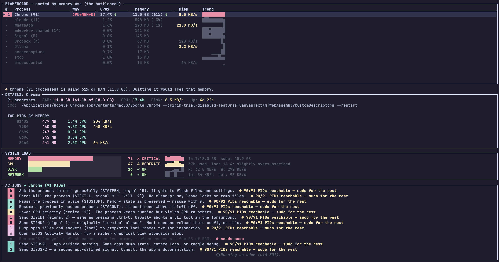

# stop

Why is my computer slow? `stop` is a top-like utility that points to the bottleneck (CPU? memory? disk? network?), names the culprit process, and offers a quick action — `k` to kill, `s` to suspend, `n` to renice — without leaving the terminal.



## Install

```bash
brew install adamatan/tap/smart-top
# or
cargo install smart-top
```

The crate is `smart-top`; the binary is `stop`.

## Usage

```
stop                # continuous watch (q to quit)
stop --once         # one-shot snapshot
stop --interval 1   # faster refresh
stop --json         # metrics + diagnosis as JSON
```

Navigation: `↑`/`↓` inspect, `Enter` expand, `q` quit.

Action keys (apply to every PID in the selected group, no confirmation):

| Key | Action | Key | Action |
|-----|--------|-----|--------|
| `s` | pause (SIGSTOP) | `r` | resume (SIGCONT) |
| `k` | soft kill (SIGTERM) | `K` | hard kill (SIGKILL) |
| `i` | Ctrl-C (SIGINT) | `H` | reload (SIGHUP) |
| `1` | SIGUSR1 | `2` | SIGUSR2 |
| `n` | renice +10 | `l` | lsof to /tmp |
| `m` | Activity Monitor (macOS) | `p` | purge cache (macOS) |

Acting on a process you don't own requires the usual OS permissions; run with `sudo` for system processes.

Run `stop --help` for the full flag list.

## Build from source

```bash
git clone https://github.com/adamatan/smart-top.git
cd smart-top
cargo build --release
# binary at target/release/stop
```

## License

Dual-licensed under [Apache 2.0](LICENSE-APACHE) or [MIT](LICENSE-MIT) at your option.

Source: https://github.com/adamatan/smart-top
